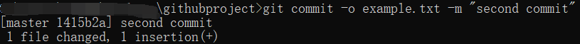

# Tutorial of Git and Github

## Menu
__1__.[Introdcution](#Introduction)

<span id="Introduction"></span>
## Introduction

### Installation

Access to 
https://git-scm.com/downloads 
to download and install git, or just install github https://docs.github.com/en/desktop/installing-and-configuring-github-desktop/installing-and-authenticating-to-github-desktop/installing-github-desktop

If you are using linux OS, things may be a little difficult, but you can install a third-party github desktop App, too.

If you will develop your projects on linux OS, I suggest you use git rather than github desktop.

Some interesting websites to learn git.

__Learn Git Branching__
English Version
https://learngitbranching.js.org/
Chinese Version
https://learngitbranching.js.org/?locale=zh_CN
Japanese Version
https://k.swd.cc/learnGitBranching-ja/


### Simple Command
#### Init a git repo
To start, we should make a new directory to save all our files.

First, make a folder, if you are using Mac OS or Linux OS, you can get access to your Desktop and then type
```
mkdir githubproject
```
Then a new folder or directory will be created.
And then, we get into the folder and we initialize the project by
```
git init
```
Then a file will be created, 


In this tutorial, I will not explain how these files work for limited time, but one thing you should remember, you can control the git activity by these files, these setting files.

#### Create a commit
When you modify the files, you want to let git track these files, you can use __git commit__ to commit, but first, maybe you should see how many changes you have made.
```
git status
```
__git status__ helps you to see the untracked files, which means, these files have not been added to the staging environment. To make sure things go correct, use the command to check.

Here, to show you the command, I create a file, and did not modify anything else.


You can see, the untracked files: example.txt

You may notice that these files are still not tracked, and untracked files will not be pushed to the server, so we should add these files and make them tracked first.

```
git add 
```

To add one file, you can use format like
```
git add <filename>
```

Or, add all the files
```
git add .
```

To make sure everythings go correct, __git status__ again.

```
git status
```


Then, we can make a commit.

```
git commit -m "<Commit Message>"
```


Sometimes, you may not commit all the files, you can use -o option to control the commit.

First, modify the example.txt, then commit again.

```
git commit -o example.txt -m "second commit"
```


It is not easy for you to control all the process of the commit, for example, we you program using C++, usually, you will get a lot of executable files which use a lot of space, and these files you do not want to commit, you can use .gitignore to ingore these files.

First, create a file named __.gitignore__ on the root of files.
The .gitignore file is like this. The .gitignore support __regular expression__.
```
# ingore txt
*.txt
```
Notice, we have already added the example.txt, so to continue this experiment, we should remove them first.
```
git rm -rf --cache <filename>
```

Then we create a new file named test.py.

Then, add it to the tracked files.

Basically, to add all the files, we use 
```
git add *.*
```
or 
```
git add .
```

And then, see the status again, we can find that the example.txt has been deleted, and test.py and .gitignore have been added.


Then, we can commit again!

```
git commit -m "Third one"
```

### Github Desktop

To simplify the process, we can use __github desktop__.


Different from complicated commands, you can just push the buttons to do things like before without typing various commands.

From now on, I hope you can upload your presentation files on github so that we can manage the process much more easily.

I will invite you as a collaborator after you send me your email or username, so, please send me as soon as possible.

You can create your own branch so that you can change anything on this project, and once if you think you upgrade it better, you can push your branch and ask for merge.

I would like to introduce more this time, but time is limited and we have other tasks to do, so if you are interested in git or github, we can talk about it on this study session and share our opinion about it.
